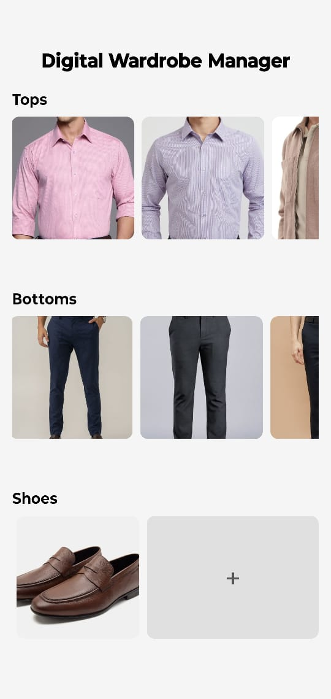
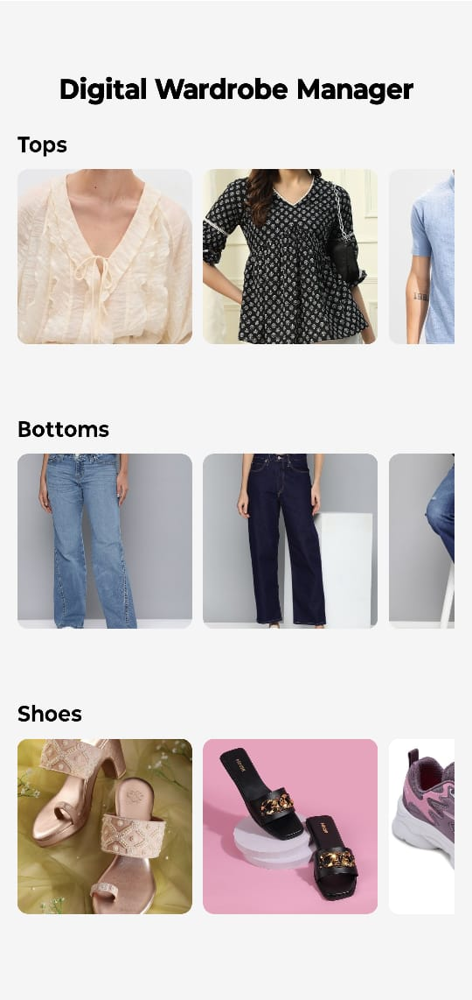
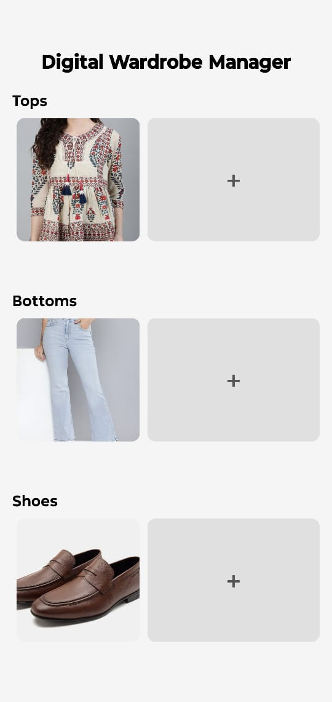

# Diwarm - Digital Wardrobe Manager

A mobile application that helps users digitally catalog and organize their clothing items by category, making wardrobe management and outfit planning effortless.

## 📷 Screenshots








## Features

- **Category Organization**: Easily organize clothing into tops, bottoms, and shoes
- **Visual Catalog**: Browse your wardrobe items with an intuitive horizontal scrolling interface
- **Simple Management**: Add new items from your device's photo gallery with a single tap
- **Easy Deletion**: Remove items with a simple long-press gesture
- **Persistent Storage**: Your wardrobe data is saved locally on your device

## Tech Stack

- React Native
- TypeScript
- Expo
- AsyncStorage
- React Hooks
- Expo Image Picker

## Installation

1. Clone the repository:
```bash
git clone https://github.com/yourusername/diwarm.git
cd diwarm
```

2. Install dependencies:
```bash
npm install
```

3. Start the development server:
```bash
npm start
```

4. Run on a device or emulator:
```bash
npm run android
# or
npm run ios
```

## Project Structure

```
diwarm/
├── App.tsx              # Application entry point
├── assets/              # Images and static assets
├── components/          # Reusable UI components
│   ├── AddButton.tsx    # Button for adding new items
│   └── ImageGrid.tsx    # Horizontal scrollable image grid
├── screens/             # Application screens
│   └── WardrobeScreen.tsx  # Main wardrobe management screen
├── utils/               # Utility functions
│   └── storage.ts       # AsyncStorage handling
├── app.json             # Expo configuration
└── package.json         # Project dependencies
```

## Usage

1. Open the app on your device
2. Browse through your clothing categories
3. Tap the "+" button to add new items from your photo gallery
4. Long-press on any item to delete it
5. Scroll horizontally to view all items in each category

## Future Enhancements

- Cloud synchronization across devices
- Advanced categorization with custom labels
- Outfit creation functionality
- Weather-based outfit suggestions
- Social sharing features
- Calendar integration for outfit planning

## Contributing

1. Fork the repository
2. Create your feature branch (`git checkout -b feature/amazing-feature`)
3. Commit your changes (`git commit -m 'Add some amazing feature'`)
4. Push to the branch (`git push origin feature/amazing-feature`)
5. Open a Pull Request

## License

Will be updated soon.

## Contact

Your Name - [anuragt1604@gmail.com](mailto:anuragt1604@gmail.com)

Project Link: [https://github.com/etrygan/diwarm](https://github.com/etrygan/diwarm)
